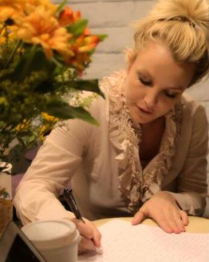
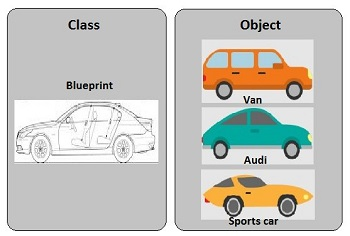

# Oops! Intro To Object Oriented Programming With Ruby


### SWBATs:
1. Describe the purpose of object oriented programming (OOP)
3. Create and instantiate classes
4. Pass arguments to new by defining an `initialize` method in class
5. Define attribute readers and writers using `attr_` macros
    - `attr_accessor`
    - `attr_reader`
    - `attr_writer`
6. Use instance and class variables appropriately
7. Use `self` for both class and instance appropriately
8. Get more practice with array compositions (`each`, `map`, `select`, `find`)


___ 

## Everything in Ruby is an object

Eveything in Ruby can have attributes and/or methods associated with it! There is more to everything in Ruby than meets the eye. Let's take a plain ol' regular integer, for example, like the number `3`. This integer `3` is also an object and we can do all sorts of interesting things with it besides adding to it, subtracting from it, multiplying it, dividing it, etc!

Go ahead in IRB and type the following:
``` ruby
3.methods
```

What do you see? 
<p>
<details>
<summary>Click this to collapse/fold and see/hide what you will probably be seeing</summary>

<pre><code>
 => [:-@, :**, :<=>, :upto, :<<, :<=, :>=, :==, :chr, :===, :>>, :[], :%, :&, :inspect, :*, :+, :ord, :-, :/, :size, :succ, :<, :>, :to_int, :coerce, :to_s, :to_i, :to_f, :divmod, :to_r, :fdiv, :modulo, :remainder, :abs, :magnitude, :integer?, :floor, :ceil, :round, :truncate, :^, :odd?, :even?, :allbits?, :anybits?, :nobits?, :downto, :times, :pred, :pow, :bit_length, :digits, :lcm, :gcd, :rationalize, :gcdlcm, :numerator, :denominator, :next, :div, :|, :~, :+@, :eql?, :singleton_method_added, :i, :real?, :zero?, :nonzero?, :finite?, :infinite?, :step, :positive?, :negative?, :clone, :dup, :arg, :rectangular, :rect, :polar, :real, :imaginary, :imag, :abs2, :angle, :phase, :quo, :conjugate, :to_c, :conj, :between?, :clamp, :instance_variable_defined?, :remove_instance_variable, :instance_of?, :kind_of?, :is_a?, :tap, :instance_variable_set, :protected_methods, :instance_variables, :instance_variable_get, :public_methods, :private_methods, :method, :public_method, :public_send, :singleton_method, :define_singleton_method, :extend, :to_enum, :enum_for, :=~, :!~, :respond_to?, :freeze, :object_id, :send, :display, :nil?, :hash, :class, :singleton_class, :itself, :yield_self, :then, :taint, :tainted?, :untaint, :untrust, :untrusted?, :trust, :frozen?, :methods, :singleton_methods, :equal?, :!, :instance_exec, :!=, :instance_eval, :__id__, :__send__] 
</code></pre>

</details>
</p>

By using the `#methods` method, we can learn what an object's methods are! Notice that the operators `+`, `-`, `*`, and `/` are all methods, too. 

#### Try this!
- Go ahead and take a look at the methods that are associated with the string `"one more time"`!
- Okay, now what happens when you type in IRB `3.class` or `"one more time".class`?

___

## What is a class?

So far we learned that everything in Ruby is an object and each object is associated with a class such as the classes that come with the Ruby language like `Integer`, `String`, or `Array` for example.

We've looked at some of the basic data types that Ruby gives us like strings, integers, floating points, booleans, etc. We have many data types that we can work with, but the problem is that not all things or data/information or entities in the world can be represented by just one of those pieces of information (integer, string, boolean,...). How could we effectively represent a person or a bank account with just a number or just a string? 

This is where classes come in handy. Essentially, Ruby allows us to create our own data types that allow us to represent a person or a bank account or whatever else we would want to represent in our program. One way we can think of a class is as a custom data type or the blueprint/template for an actual entity in the real world.

Let's say I want to represent a performer inside of my program. I can say that my performer has a first name, last name, number of awards, number of albums, and is/is not on tour. 

``` RUBY
class Performer
    attr_accessor :first_name, :last_name, :num_of_awards, :num_of_albums, :is_on_tour, :age, :birth_year
end

```
So here, we are defining a `class` called `Performer` that has attributes `first_name`, `last_name`, `num_of_awards`, `num_of_albums`, `age`, `is_on_tour`, and `birth_year`.


___

## Instantiating a class

Okay, so we created a class, a framework that represents some real life entity. Now what? Now that we've told Ruby what a `Performer` is, we can actually go and create individual performers. These are called objects or instances of the class. We can create an *instance* of that class. You may also hear "instantiate a class". To instantiate the performer class for example, we would write the following in Ruby:
```RUBY
britney = Performer.new
```

The line above is just telling Ruby that we want to create a new performer called britney. What do you think will be returned from `britney.class`?

Great! So we have a variable named `britney` who is of type `Performer`. We can go ahead and give attributes to `britney` using dot notation like the following:

```RUBY
britney.first_name = "Britney"
britney.last_name = "Spears"
britney.birth_year = 1981
britney.age = 31
britney.is_on_tour = true
britney.num_of_albums = 7
britney.num_of_awards = 9
```


We created this `Performer` object called `britney` and we gave it various attributes that we can interact with.  

#### Try this!
- Print out various attributes of `britney` 
- Change britney's `is_on_tour` attribute to `false`
<!-- - What methods are associated with `britney`?
    - `britney.methods` -->
- Create another instance of `Performer` called `justin`


___

## Methods

We can also define methods within our classes. Just like how the `Integer` class or the `String` class are associated with methods that we can use on integers and strings respectively, we may want our performer to be able to introduce themselves, to talk with other performers, to release a new album, or to win a new award, for example. 

### Initialize Method

What if we had more attributes that we needed to assign to `britney`? What if we wanted to create 4 more instances of  `Performer`? We know how to do that now, but it would sure get tedious writing out all those lines of code for each object. There's actually a way we can pass in information to our objects right upfront when we create them using the `initialize` method. We're so LUCKY! 

```RUBY
class Performer
    attr_accessor :first_name, :last_name, :num_of_awards, :num_of_albums, :is_on_tour, :age, :birth_year

    def initialize (first_name, last_name, num_of_albums, num_of_awards, is_on_tour, birth_year)
        @first_name = first_name
        @last_name = last_name
        @num_of_albums = num_of_albums
        @num_of_awards = num_of_awards
        @is_on_tour = is_on_tour
        @birth_year = birth_year
        @age = Time.now.year - @birth_year
    end
end

britney = Performer.new("Britney", "Spears", 16, 192, true, 1981)
whitney = Performer.new("Whitney", "Houston", 16, 106, false, 1963)
justin = Performer.new("Justin", "Timberlake", 9, 176, true, 1981)
shakira = Performer.new("Shakira", "Mebarak Ripoll", 21, 264, true, 1977)
rhianna = Performer.new("Robyn Rihanna", "Fenty"), 13, 234, true, 1988)
```

Inside of our class definition above, you can see we defined a method called `initialize` just as we would define any other method. The parameters of the method are all of the attributes within the class except for `age`. I chose not to make `age` a parameter because knowing the performer's `birth_year`, we can calculate the performer's age using a Ruby's `Time.now.year` to get the current year.

### Let's add some more capabilities to our class
Let's say we want to write some methods that will allow us to interact more with performer's attributes and other performers. 

We're going to add the capability for:
- a performer to win an award
- a performer to release a new album
- a performer to collaborate with another performer

```Ruby
class Performer
    attr_accessor :first_name, :num_of_awards, :num_of_albums, :is_on_tour

    def initialize (first_name, num_of_albums, num_of_awards, is_on_tour)
        @first_name = first_name
        @num_of_albums = num_of_albums
        @num_of_awards = num_of_awards
        @is_on_tour = is_on_tour
    end

    def win_an_award 
        @num_of_awards += 1
        puts "#{@first_name} now has #{@num_of_awards} awards!"
    end

    def release_album 
        @num_of_albums += 1
        puts "#{@first_name} just released their #{@num_of_albums} album!"
    end

    def collaborate (artist)
        if artist
            puts "#{@first_name} and #{artist.first_name} are going on tour together!"
            @is_on_tour = true
            artist.is_on_tour = true
        end
    end
end

britney = Performer.new("Britney", 16, 9, false)
justin = Performer.new("Justin", 7, 22, false)

britney.win_an_award()
britney.release_album()
justin.collaborate(britney)
```

<p>
<details>
<summary> Collapse to see what the above code will print</summary>

<pre><code>
Britney now has 10 awards!
Britney just released their 17 album!
Justin and Britney are going on tour together!
</code></pre>

</details>
</p>


--- 

## Instance vs Class Variables

### Instance Variables @

You may be wondering what the symbol `@` means in our program. When we write `@first_name`, we are referring to the `first_name` that belongs to the instance of the class. The `first_name` parameter is the argument that the user is passing through to the method and that is called a *local variable*. The local variable only exists within the context of the method in which it's defined. By using the `@`, we are differentiating the instance variable from the local variable. Read the code below and try to predict what will print out. Then actually run it to test your guesses.

```RUBY
class Performer
    attr_accessor :first_name

    def initialize (first_name)
        puts "1. @first_name is #{@first_name}, first_name is #{first_name}"

        @first_name = first_name
        puts "2. @first_name is #{@first_name}, first_name is #{first_name}"

        @first_name = "anonymous"
        puts "3. @first_name is #{@first_name}, first_name is #{first_name}"
    end
end

britney = Performer.new("britney")
puts "#{britney.first_name} is my favorite performer!"
```
<p>
<details>
<summary> Collapse to see what the above code will print</summary>

<pre><code>
1. @first_name is , first_name is britney
2. @first_name is britney, first_name is britney
3. @first_name is anonymous, first_name is britney
anonymous is my favorite performer!
</code></pre>

</details>
</p>


### Class vairables @@

Similarly, using `@@` instead of `@` refers to a different type of variable called a *class variable*. A class variable is an attribute that is shared among all instances of a class. If the value of a class variable is changed for one instance of a class, it is also changed for all other instances of a class. Read the code below and try to predict what will print out. Then actually run it to test your guesses. 

```Ruby
class Performer
    attr_accessor :first_name
    @@genre = "pop"

    def initialize (first_name)
        @first_name = first_name
    end

    def genre
        @@genre
    end

    def genre=(genre)
        @@genre = genre
    end
end

britney = Performer.new("Britney")
justin = Performer.new("Justine")
whitney = Performer.new("whitney")

puts "#{britney.first_name}, #{britney.genre} "
puts "#{justin.first_name}, #{justin.genre} "
puts "#{whitney.first_name}, #{whitney.genre} "

britney.genre = "rap"
puts "#{britney.first_name}, #{britney.genre} "
puts "#{justin.first_name}, #{justin.genre} "
puts "#{whitney.first_name}, #{whitney.genre} "

justin.genre = "classical"
puts "#{britney.first_name}, #{britney.genre} "
puts "#{justin.first_name}, #{justin.genre} "
puts "#{whitney.first_name}, #{whitney.genre} "
```
<p>
<details>
<summary> Collapse to see what the above code will print</summary>

<pre><code>
Britney, pop 
Justine, pop 
whitney, pop 
Britney, rap 
Justine, rap 
whitney, rap 
Britney, classical 
Justine, classical 
whitney, classical 
</code></pre>

</details>
</p>


___



## Attribute Macros

In the examples where we created our class `Performer` we see a keyword called `attr_accessor`. This keyword gives certain meaning to how we can interact with attributes. We also have two other keywords that we can use instead called `attr_reader` and `attr_writer` that also give different meaning to how we can interact with our attributes.

Let's start by defining a class `Peformer` like this:
``` RUBY
class Performer
end

britney = Performer.new
britney.name #=> no method error
```
Well, we never defined a method called `name` in our `Performer` class, so that error makes sense. Let's create a method called to read the value!
``` RUBY
class Performer
    def name
        @name
    end
end

britney = Performer.new
britney.name #=> nil
britney.name = "Britney Spears" #=> no method error
```
So, here we can read the value of the variable `name`, but we can't assign it a value. That's because reading and assigning a value are two different methods. Let's create a method to assign the value!

``` RUBY
class Performer
    # this method is called a 'reader' or a 'getter'
    def name
        @name
    end

    # this method is called a 'writer' or a 'setter'
    def name=(full_name)
        @name = full_name
    end
end

britney = Performer.new
britney.name #=> nil
britney.name = "Britney Spears"
britney.name #=> Britney Spears
```

Reading and writing attributes are done so frequently that Ruby decided it should create `attr_reader` and `attr_writer` to make our lives easier by enabling us to not have to write getter and setter methods for every attribute we wish to read or write to! `attr_reader` and `attr_write` generate getter and setter methods for us behind the scenes. So the above can be translated to this:
``` RUBY
class Performer
    attr_reader :name
    attr_writer :name
end

britney = Performer.new
britney.name #=> nil
britney.name = "Britney Spears"
britney.name #=> Britney Spears
```

Then again, Ruby decided it wanted to make our lives even easier and so we can use `attr_accessor` if we want to both the reader and writer!
``` RUBY
class Performer
    attr_accessor :name
end

britney = Performer.new
britney.name #=> nil
britney.name = "Britney Spears"
britney.name #=> Britney Spears
```


## Review Questions/Problems
<p>
<details>
<summary> What's a class? What's an object?</summary>
<pre> 
<p>
A class is a template or blueprint that defines the properties/attributes (variables) and the behavior (methods) common to all objects of a certain kind. An object is an instance of a class.
</p>
</pre>
</details>
</p>

<p>
<details>
<summary> What's the difference between <code>@</code> and <code>@@</code>?</summary>
<pre><p>
Variables prefixed with <code>@</code> are instance variables and variables prefixed with <code>@@</code> are class variables.
</p></pre>

</details>
</p>

<p>
<details>
<summary> What's the difference between a local variable, an instance variable, and a class variable?</summary>
<pre><p>
Local variables only exist inside of a code block or method. Instance variables are visible to all of the methods in the class and only belong to one instance of a class. Class variables are visible to all instances of a that class.
</p></pre>
</details>
</p>

## Break Out Room Activity

Choose one of the following to complete with your group.

1. Here is a naive Ruby implementation of a bank with bank accounts using an array and hash which stores key-value pairs. 
```Ruby
bank_account1 = { account_number: 12345, balance: 100 }
bank_account2 = { account_number: 12345, balance: 100 }
bank_account3 = { account_number: 12345, balance: 100 }
bank_account4 = { account_number: 12345, balance: 100 }

bank = [bank_account1, bank_account2, bank_account3, bank_account4]
```

Write an implementation of a bank that meets the following requirements:

    - Bank should have bank accounts
    - Bank accounts keep track of the account holder name, balance, account number, & the year the account was created
    - Money can be withdrawn from a bank account
    - Money can be added into a bank account
    - Bank can find a bank account based on the account number
    - Bank can find bank accounts with a balance greater than $10,000




2. Here is another naive implementation of a used car dealership with cars in Ruby using only an array and a hash.
```Ruby
car1 = { make: "Audi", model_year: 2010 }
car2 = { make: "Acura", model_year: 2004 }
car3 = { make: "Bentley", model_year: 2002 }
car4 = { make: "BMW", model_year: 2019 }

dealership = [car1, car2, car3, car4]
```

Write an implementation of a used car dealership that meets the following requirements:

    - Dealership should have cars
    - Cars keep track of their color, make, model year, miles, selling price
    - Car prices can be increased 
    - Car prices can be decreased
    - Dealership can find cars based on their make
    - Dealership can find cars newer than 2010


___

## Extra Resources


"What is it?" - Britney

"It's **extra resources**!" - Michelle

- [Blog on Ruby Class Variables](https://maximomussini.com/posts/ruby-class-variables/)
- [Big O Notation & Complexity in Ruby](https://devblast.com/b/big-o-notation-complexity-ruby)
